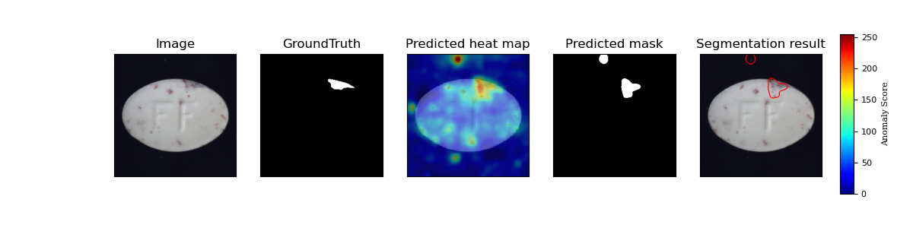
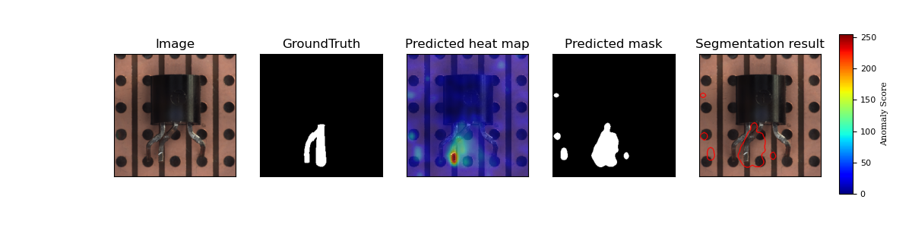

## 说明

- 项目中包含了毕业论文撰写时所需图片的制作函数

- 项目中包含了较为详细的中文注释，几个主要文件夹内容如下
  
  - plot文件夹是论文撰写时所需图片的绘图函数
  
  - datasets文件夹是数据集加载模块
  
  - imgs保存了模型相关的一些参数
  
  - mvtec_result文件夹中保存了抽取出来的正常图像的特征和具体数据定位图

- 文章中数据加载的路径是根据开发者本人PC具体数据集的放置路径相关的，读者需要自行修改路径

## 环境要求

* python == 3.7+
* pytorch == 1.5
* tqdm
* sklearn
* matplotlib

## 数据集

MVTec AD datasets : Download from [MVTec website](https://www.mvtec.com/company/research/datasets/mvtec-ad/)

## 结果

### 在METec数据集上的结果

* 图片层次的检测精度 (ROCAUC)

| MvTec               | R18-Rd100 | WR50-Rd550 |
|:-------------------:|:---------:|:----------:|
| Carpet              | 0.984     | 0.999      |
| Grid                | 0.898     | 0.957      |
| Leather             | 0.988     | 1.0        |
| Tile                | 0.959     | 0.974      |
| Wood                | 0.990     | 0.988      |
| All texture classes | 0.964     | 0.984      |
| Bottle              | 0.996     | 0.998      |
| Cable               | 0.855     | 0.922      |
| Capsule             | 0.870     | 0.915      |
| Hazelnut            | 0.841     | 0.933      |
| Metal nut           | 0.974     | 0.992      |
| Pill                | 0.869     | 0.944      |
| Screw               | 0.745     | 0.844      |
| Toothbrush          | 0.947     | 0.972      |
| Transistor          | 0.925     | 0.978      |
| Zipper              | 0.741     | 0.909      |
| All object classes  | 0.876     | 0.941      |
| All classes         | 0.905     | 0.955      |

* 像素层次的检测精度 (ROCAUC)

| MvTec               | R18-Rd100 | WR50-Rd550 |
|:-------------------:|:---------:|:----------:|
| Carpet              | 0.988     | 0.990      |
| Grid                | 0.936     | 0.965      |
| Leather             | 0.990     | 0.989      |
| Tile                | 0.917     | 0.939      |
| Wood                | 0.940     | 0.941      |
| All texture classes | 0.953     | 0.965      |
| Bottle              | 0.981     | 0.982      |
| Cable               | 0.949     | 0.968      |
| Capsule             | 0.982     | 0.986      |
| Hazelnut            | 0.979     | 0.979      |
| Metal nut           | 0.967     | 0.971      |
| Pill                | 0.946     | 0.961      |
| Screw               | 0.972     | 0.983      |
| Toothbrush          | 0.986     | 0.987      |
| Transistor          | 0.968     | 0.975      |
| Zipper              | 0.976     | 0.984      |
| All object classes  | 0.971     | 0.978      |
| All classes         | 0.965     | 0.973      |

### ROC 曲线

* 用ResNet18预训练特征抽取器的结果

    

* 用Wide_ResNet50预训练特征抽取器的结果

    

### 缺陷定位效果图实例

    

    

    

    

    

    

    

    

    

    

    

    

    

    

    

## 参考

[1] Thomas Defard, Aleksandr Setkov, Angelique Loesch, Romaric Audigier. *PaDiM: a Patch Distribution Modeling Framework for Anomaly Detection and Localization*. https://arxiv.org/pdf/2011.08785

[2] https://github.com/byungjae89/SPADE-pytorch

[3] https://github.com/byungjae89/MahalanobisAD-pytorch
